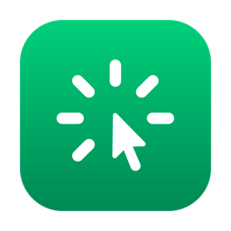
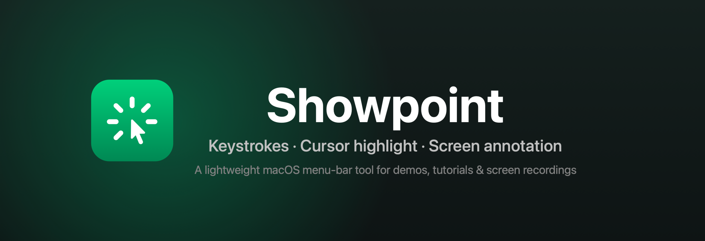
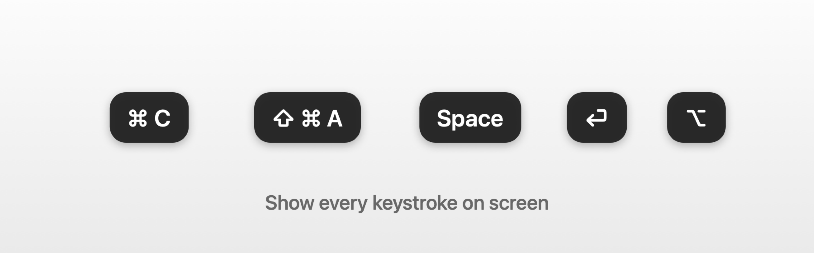
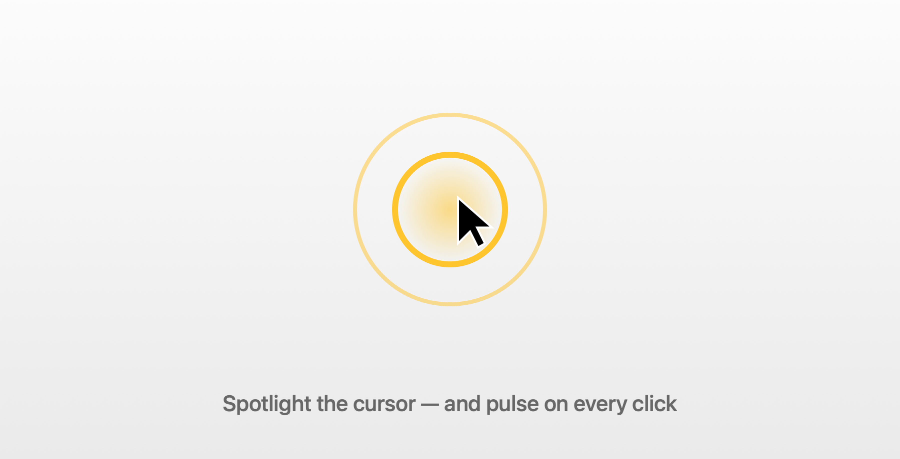
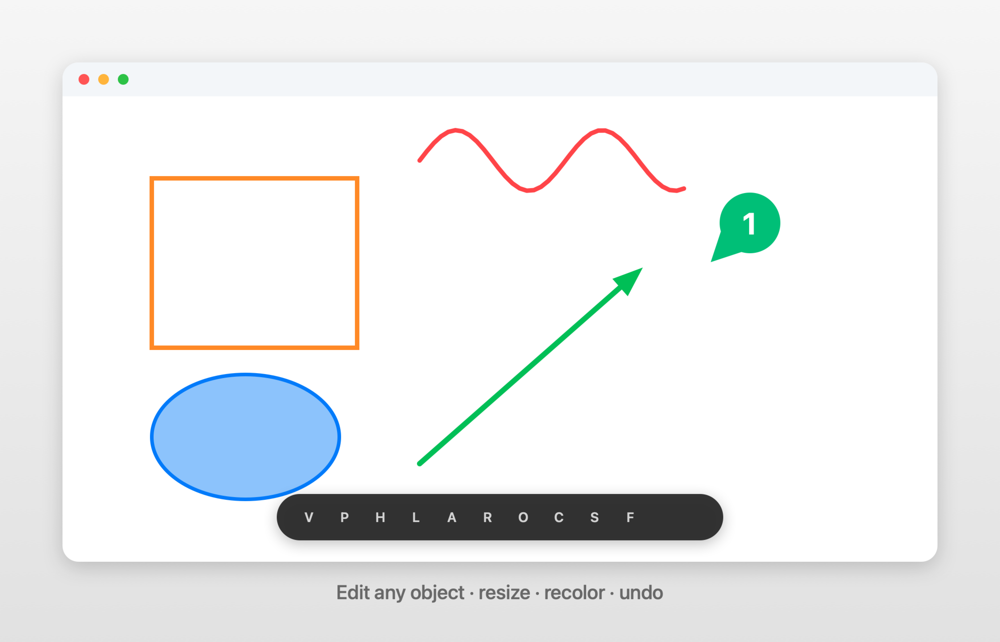

<div align="center">



# Showpoint

**Keystrokes · Cursor highlight · Screen annotation — for macOS.**

A lightweight, native menu-bar app that makes your screen easy to follow during
demos, tutorials, screen recordings, and live presentations.

[](../../releases/latest)
&nbsp;
[](https://oleksii-stepanenko.github.io/showpoint/)
&nbsp;


**🌐 [oleksii-stepanenko.github.io/showpoint](https://oleksii-stepanenko.github.io/showpoint/)**



</div>

---

## ✨ What it does

Showpoint lives in your menu bar and adds three things your audience will thank you for:

### ⌨️ Show your keystrokes



Every key and shortcut appears on screen in clean capsules — `⌘C`, `⇧⌘A`, `Space`,
arrows, function keys. Combos collapse into a single capsule, bare modifier taps show
on their own, and **passwords are never captured** (macOS secure input blocks it).

### 🔦 Highlight the cursor



A smooth halo follows your pointer across every display, with a pulse on each click.
Choose a **disc, ring, squircle, or rhombus**, your color, size, and opacity.

### ✏️ Annotate the screen



Draw over anything with **pen, highlighter, line, arrow, rectangle, ellipse,
counter, and spotlight**. Every object is **editable** — click to select, drag to move,
grab handles to resize, recolor from a palette, undo, or delete. Counters auto-number;
spotlight dims everything but the area you care about.

---

## 🚀 Install

### Homebrew (recommended)

```sh
brew install --cask oleksii-stepanenko/tap/showpoint
```

### Direct download

**[Download the latest `.dmg`](../../releases/latest)**, open it, and drag **Showpoint**
to your **Applications** folder.

### First launch

Showpoint is signed with a self-signed certificate but **not notarized** by Apple (that
needs a paid Apple Developer ID), so macOS gates the first launch. Pick either:

- **Open via Settings:** double-click Showpoint, then go to **System Settings → Privacy &
  Security**, scroll to **Security**, and click **Open Anyway**. (This recurs after each
  update.) — or —
- **Clear the quarantine flag** so it just opens, in **Terminal**:

  ```sh
  xattr -dr com.apple.quarantine /Applications/Showpoint.app
  ```

> The app is **not** "damaged" — the signature is valid; it's simply not notarized by
> Apple. Because the signature is stable, the **Accessibility** permission below survives
> updates (only the Gatekeeper step above recurs).

Then open **Showpoint** from Applications — it lives in the **menu bar** (no Dock icon).
The first time you show keystrokes or use a shortcut, macOS asks for **Accessibility**
permission (System Settings → Privacy & Security → Accessibility). Grant it once and
Showpoint starts working automatically.

---

## ⌨️ Hands-free shortcuts

Tap a chosen modifier key (default **⌃ Control**, configurable in Settings → General):

| Gesture | Action |
| --- | --- |
| **Double-tap** the key | Toggle cursor highlight **+ keystrokes** together |
| **Triple-tap** the key | Toggle annotation |

## 🎨 While annotating

| Key | Tool | Key | Tool |
| --- | --- | --- | --- |
| `V` | Select | `R` | Rectangle |
| `P` | Pen | `O` | Ellipse |
| `H` | Highlighter | `C` | Counter |
| `L` | Line | `S` | Spotlight |
| `A` | Arrow | | |

| Key | Action |
| --- | --- |
| `Tab` | Cycle the selected object's color |
| `F` | Toggle fill |
| `⌘Z` | Undo |
| `⌫` | Delete selected object |
| `⇧⌫` | Clear all |
| `Esc` | Exit the current tool, then exit annotation |

---

## 🛠 Build from source

Requires **Xcode 15+** (macOS 14 SDK) and [XcodeGen](https://github.com/yonik/XcodeGen).

```sh
brew install xcodegen
git clone <this-repo> && cd Showpoint
xcodegen generate        # creates Showpoint.xcodeproj from project.yml
open Showpoint.xcodeproj  # then ⌘R
```

The Xcode project is generated from [`project.yml`](project.yml) and is **not** committed —
run `xcodegen generate` after cloning.

---

## 🗺 Roadmap

- ✅ Keystroke display · cursor highlight · annotation with editable objects
- ✅ Counter & spotlight tools, resize handles, color palette, shortcuts
- ⏳ Text tool · blur (needs ScreenCaptureKit) · full-screen zoom

---

## 📄 About

**Author:** Oleksii Stepanenko · **License:** Free · Built natively in Swift / SwiftUI.

Inspired by tools like Presentify, KeyScreen, and Shottr.
